This is a [Next.js](https://nextjs.org) project bootstrapped with [`create-next-app`](https://github.com/vercel/next.js/tree/canary/packages/create-next-app).

## Getting Started

First, run the development server:

```bash
npm run dev
# or
yarn dev
# or
pnpm dev
# or
bun dev
```

Open [http://localhost:3000](http://localhost:3000) with your browser to see the result.

You can start editing the page by modifying `app/page.js`. The page auto-updates as you edit the file.

This project uses [`next/font`](https://nextjs.org/docs/app/building-your-application/optimizing/fonts) to automatically optimize and load [Geist](https://vercel.com/font), a new font family for Vercel.

## Learn More

To learn more about Next.js, take a look at the following resources:

- [Next.js Documentation](https://nextjs.org/docs) - learn about Next.js features and API.

  
classDiagram
    class User {
        +id: Int
        +username: String
        +email: String
        +passwordHash: String
        +fullName: String
        +phoneNumber: String
        +roleId: Int
        +isActive: Boolean
        +createdAt: DateTime
        +updatedAt: DateTime
        +login()
        +logout()
        +updateProfile()
    }

    class Role {
        +id: Int
        +name: String
        +description: String
        +createdAt: DateTime
        +updatedAt: DateTime
        +getPermissions()
    }

    class Permission {
        +id: Int
        +name: String
        +description: String
        +createdAt: DateTime
    }

    class Product {
        +id: Int
        +categoryId: Int
        +name: String
        +description: String
        +barcode: String
        +sku: String
        +unitPrice: Decimal
        +costPrice: Decimal
        +quantity: Int
        +minimumQuantity: Int
        +maximumQuantity: Int
        +supplierId: Int
        +imageUrl: String
        +isActive: Boolean
        +createdAt: DateTime
        +updatedAt: DateTime
        +updateStock()
        +calculateValue()
    }

    class Category {
        +id: Int
        +name: String
        +description: String
        +parentId: Int
        +createdAt: DateTime
        +updatedAt: DateTime
    }

    class Supplier {
        +id: Int
        +name: String
        +contactPerson: String
        +email: String
        +phone: String
        +address: String
        +createdAt: DateTime
        +updatedAt: DateTime
    }

    class InventoryTransaction {
        +id: Int
        +productId: Int
        +transactionType: String
        +quantity: Int
        +referenceId: Int
        +referenceType: String
        +userId: Int
        +notes: String
        +createdAt: DateTime
    }

    class AuditLog {
        +id: Int
        +userId: Int
        +action: String
        +tableName: String
        +recordId: Int
        +oldValues: Json
        +newValues: Json
        +ipAddress: String
        +createdAt: DateTime
    }

    User "*" -- "1" Role : has
    Role "*" -- "*" Permission : has
    Product "*" -- "1" Category : belongsTo
    Product "*" -- "1" Supplier : suppliedBy
    Product "1" -- "*" InventoryTransaction : has
    User "1" -- "*" InventoryTransaction : creates
    User "1" -- "*" AuditLog : generates
```

<antArtifact identifier="use-case-diagram" type="application/vnd.ant.mermaid" title="System Use Case Diagram">


```mermaid
graph TB
    subgraph Actors
        Admin[Admin]
        User[Regular User]
    end

    subgraph Authentication
        Login[Login]
        Logout[Logout]
        ManageUsers[Manage Users]
    end

    subgraph Inventory Management
        AddProduct[Add Product]
        EditProduct[Edit Product]
        DeleteProduct[Delete Product]
        ViewInventory[View Inventory]
        ImportProducts[Import Products]
        ExportProducts[Export Products]
        ManageCategories[Manage Categories]
        ManageSuppliers[Manage Suppliers]
        TrackStock[Track Stock Levels]
    end

    subgraph System Features
        GenerateReports[Generate Reports]
        ViewAuditLogs[View Audit Logs]
        ManageSettings[Manage Settings]
    end

    Admin --> Login
    User --> Login
    Admin --> ManageUsers
    Admin --> ManageSettings
    Admin --> ViewAuditLogs
    
    Admin & User --> ViewInventory
    Admin & User --> AddProduct
    Admin & User --> EditProduct
    Admin --> DeleteProduct
    Admin & User --> ImportProducts
    Admin & User --> ExportProducts
    Admin --> ManageCategories
    Admin --> ManageSuppliers
    Admin & User --> TrackStock
    Admin & User --> GenerateReports
    Admin & User --> Logout
```

### System Overview

1. **Authentication System**
   - JWT-based authentication
   - Role-based access control (RBAC)
   - Secure password hashing with bcrypt
   - HTTP-only cookie session management
   - 8-hour session duration

2. **Directory Structure**
```
winehouse-inventory-pos/
├── app/
│   ├── api/
│   │   ├── auth/
│   │   ├── inventory/
│   │   ├── categories/
│   │   └── suppliers/
│   ├── components/
│   │   ├── layout/
│   │   ├── inventory/
│   │   └── shared/
│   ├── context/
│   ├── hooks/
│   ├── lib/
│   └── styles/
├── prisma/
└── public/
```

3. **Key Features**

   a. **Authentication & Authorization**
   - Login system with JWT tokens
   - Role-based access control
   - Protected routes
   - Audit logging

   b. **Inventory Management**
   - Product CRUD operations
   - Barcode support
   - Stock level tracking
   - Category management
   - Supplier management
   - Batch import/export
   - Stock history tracking

   c. **User Interface**
   - Responsive design
   - Dark/light theme support
   - Advanced AG Grid implementation
   - Material-UI components
   - Form and upload options for adding products
   - Interactive data tables
   - Real-time search and filtering

4. **Database Schema**

   a. **User Management Tables**
   - users
   - roles
   - permissions
   - role_permissions

   b. **Inventory Tables**
   - products
   - categories
   - suppliers
   - inventory_transactions

   c. **Audit Tables**
   - audit_logs
   - settings

5. **Technical Stack**
   - Frontend: Next.js 13+ (App Router)
   - UI: Material-UI, AG Grid Community
   - Database: MySQL with Prisma ORM
   - Authentication: JWT with HTTP-only cookies
   - File Processing: XLSX for imports

6. **Components Breakdown**

   a. **Layout Components**
   - Navigation system with collapsible sidebar
   - Theme toggle
   - Responsive header

   b. **Inventory Components**
   - ProductFormModal for single product addition
   - ProductUploadModal for batch imports
   - DeleteConfirmModal for confirmations
   - StatusBarComponent for grid statistics
   - Custom cell renderers for AG Grid

   c. **Shared Components**
   - SnackbarProvider for notifications
   - ThemeProvider for dark/light mode
   - LoadingProvider for loading states

7. **Security Features**
   - Password hashing
   - JWT token management
   - Protected API routes
   - RBAC implementation
   - Audit logging
   - Input validation
   - XSS protection
   - CSRF protection

8. **Data Management**
   - Optimistic updates
   - Batch processing
   - Real-time filtering
   - Data export capabilities
   - Transaction logging
   - Stock history tracking

9. **UI/UX Features**
   - Responsive design
   - Mobile-first approach
   - Advanced filtering
   - Sort capabilities
   - Batch operations
   - Excel import/export
   - Theme switching
   - Interactive notifications

10. **API Endpoints**
    - Authentication routes
    - Inventory management routes
    - User management routes
    - Category management routes
    - Supplier management routes
    - Report generation routes


- [Learn Next.js](https://nextjs.org/learn) - an interactive Next.js tutorial.

You can check out [the Next.js GitHub repository](https://github.com/vercel/next.js) - your feedback and contributions are welcome!

## Deploy on Vercel

The easiest way to deploy your Next.js app is to use the [Vercel Platform](https://vercel.com/new?utm_medium=default-template&filter=next.js&utm_source=create-next-app&utm_campaign=create-next-app-readme) from the creators of Next.js.

Check out our [Next.js deployment documentation](https://nextjs.org/docs/app/building-your-application/deploying) for more details.
